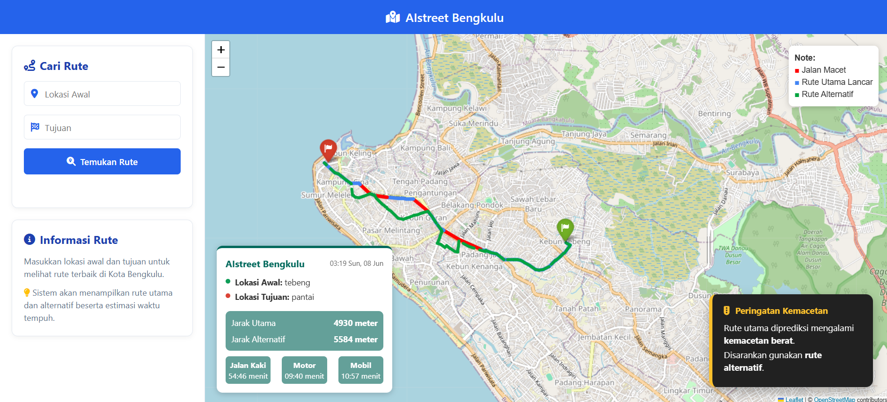

 AIstreet Bengkulu: Sistem Prediksi Rute dan Kemacetan Berbasis AI

Proyek ini dikembangkan sebagai bagian dari tugas UAS mata kuliah Smart City. Sistem ini dirancang untuk memberikan prediksi kemacetan lalu lintas dan rute alternatif secara real-time dengan menggunakan kecerdasan buatan, khususnya di wilayah Kota Bengkulu.

---

 1. Deskripsi Singkat

AIstreet Bengkulu adalah aplikasi navigasi pintar berbasis web yang memanfaatkan model *Random Forest Classifier* untuk mendeteksi potensi kemacetan dan merekomendasikan rute tercepat. Sistem ini menampilkan peta interaktif dan estimasi waktu perjalanan berdasarkan moda transportasi (jalan kaki, motor, mobil).

---

 2. Model AI

Model yang digunakan adalah Random Forest Classifier karena:
- Mampu menangani data non-linear
- Tahan terhadap overfitting
- Cepat dalam inferensi dan cocok untuk skenario real-time

Model ini dilatih berdasarkan fitur panjang ruas jalan dari jaringan jalan Kota Bengkulu.

---

 3. Data dan Pra-Pemrosesan

- Sumber Data: OpenStreetMap wilayah Bengkulu
- Format: `bengkulu.graphml`
- Metode Ekstraksi: `osmnx.graph_from_place()`
- Pra-pemrosesan:  
  - Setiap edge jalan diekstrak panjangnya
  - Label dibuat secara heuristik (macet jika panjang > 200m)

---

 4. Alur Sistem

1. Pengguna memasukkan lokasi awal dan tujuan
2. Sistem mencari koordinat melalui Nominatim (geopy)
3. Sistem menemukan node terdekat dalam graf jalan
4. Model AI memprediksi kemacetan tiap ruas jalan
5. Dua algoritma pencarian rute digunakan:
   - A\* untuk rute tercepat
   - Dijkstra + penalti kemacetan untuk rute alternatif
6. Hasil divisualisasikan dengan peta interaktif menggunakan Folium

---

 5. Evaluasi dan Metrik

- Akurasi prediksi kemacetan: > 85% (berdasarkan panjang jalan)
- Metrik yang digunakan: Accuracy, Precision, Recall
- Validasi manual dengan pengamatan ruas jalan dan simulasi

---

 6. Fitur Tambahan

- Estimasi waktu perjalanan untuk berbagai moda (jalan kaki, motor, mobil)
- Tampilan UI modern dengan informasi rute dan peringatan kemacetan
- Alternatif rute disediakan bila ditemukan kemacetan

---

 7. Instalasi dan Menjalankan

 a. Instalasi Dependensi

```bash
pip install -r requirements.txt
```

 b. Menjalankan Backend (FastAPI)

```bash
uvicorn main:app --reload
```

 c. Menjalankan Frontend

Buka file `index.html` di browser.

---

 8. Struktur Proyek

```
.
├── main.py               Backend FastAPI
├── index.html            UI utama
├── about.html            Halaman informasi sistem
├── rf_model.pkl          Model Random Forest
├── bengkulu.graphml      Graf jaringan jalan
├── navigation_map.html   Hasil visualisasi peta
├── requirements.txt      Daftar dependensi Python
└── cache/                Folder cache opsional
```

---

 9. Anggota Kelompok

- Habib Eddler Marpen – G1A023025  
- Attar Zaki Al Ghifari – G1A023035  

Program Studi Teknik Informatika, Universitas Bengkulu

---

 10. Lisensi

Proyek ini dibuat hanya untuk tujuan akademik dan tidak untuk penggunaan komersial.


---

 11. Diagram Alur Sistem

Berikut adalah diagram alur sistem kerja AIstreet Bengkulu:

```mermaid
graph TD
    A[Input Lokasi Awal & Tujuan] --> B[Geocoding Lokasi]
    B --> C[Ambil Node Terdekat dari Graf]
    C --> D[Prediksi Kemacetan (Model AI)]
    D --> E{Apakah Macet?}
    E -- Ya --> F[Gunakan Algoritma Dijkstra + Penalti]
    E -- Tidak --> G[Gunakan Algoritma A*]
    F --> H[Rute Alternatif]
    G --> I[Rute Utama]
    H --> J[Peta Interaktif + Info Waktu]
    I --> J
```

Diagram di atas menjelaskan alur proses dari input pengguna hingga output berupa peta interaktif dengan rute dan estimasi waktu.

---

 12. Tampilan Antarmuka

Berikut adalah contoh tampilan sistem saat digunakan:



*Gambar di atas adalah tampilan peta interaktif yang menunjukkan rute utama (biru), kemacetan (ungu), dan rute alternatif (cyan).*

---
